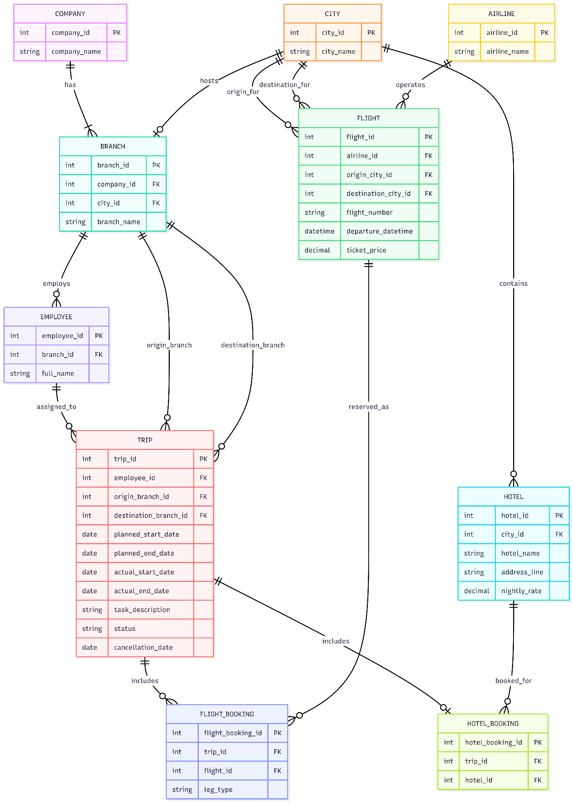

# Business Travel Management SQL Database

The project is designed as a PostgreSQL schema-first pet project that can be shown in a résumé or portfolio. It demonstrates relational design, integrity constraints, realistic seed data, and non-trivial SQL queries based on business rules.

## Business scenario

A company operates through several branches, each located in a different city. Employees travel between branches for meetings, negotiations, audits, workshops, and coordination tasks. For each trip, the system stores the planned schedule, actual execution state, hotel accommodation, and flight bookings for outbound and return legs.

The model also supports cancelled trips and makes it possible to analyze travel costs, booking geography, and organizational patterns such as repeated same-day travel on the same route.

## Data model

Core entities:
- `company`
- `city`
- `airline`
- `branch`
- `employee`
- `hotel`
- `flight`
- `trip`
- `hotel_booking`
- `flight_booking`


## Repository structure

```text
business_travel_sql_pet_project/
├── README.md
├── docs/
│   └── comments_to_queries.md
├── images/
│   └── er_diagram.png
└── sql/
    ├── 01_schema.sql
    ├── 02_seed.sql
    ├── 03_check_data.sql
    └── queries/
        ├── 01_hotels_in_paris_for_berlin_employees.sql
        ├── 02_hotel_spending_by_hotel_city_last_month.sql
        ├── 03_hotel_spending_by_employee_city_last_month.sql
        ├── 04_top_branches_by_last_minute_cancellations.sql
        └── 05_same_day_same_route_different_flights.sql
```

## ER diagram



## Tech stack

This project targets PostgreSQL and uses PostgreSQL-specific features such as:
- `GENERATED ALWAYS AS IDENTITY`,
- `NUMERIC(p, s)` and timestamp/date types,
- `CHECK` constraints with business-state logic,
- `date_trunc`,
- `EXTRACT`,
- interval arithmetic,
- schema-qualified object names.

## Launch

Create a PostgreSQL database and run the scripts in order.

```bash
psql -d your_database -f sql/01_schema.sql
psql -d your_database -f sql/02_seed.sql
psql -d your_database -f sql/03_check_data.sql
```

Then run any query from the `sql/queries/` directory, for example:

```bash
psql -d your_database -f sql/queries/01_hotels_in_paris_for_berlin_employees.sql
```


## Query highlights

The repository contains five showcase queries. Their report-style explanations and result notes are collected in `docs/comments_to_queries.md`.

`01_hotels_in_paris_for_berlin_employees.sql` finds all hotels in Paris that were booked by employees whose home branch is located in Berlin during the current calendar year.

`02_hotel_spending_by_hotel_city_last_month.sql` aggregates hotel spending by the city where the hotel is located for the previous calendar month.

`03_hotel_spending_by_employee_city_last_month.sql` aggregates hotel spending by the home city of the employee for the previous calendar month.

`04_top_branches_by_last_minute_cancellations.sql` returns the top three origin branches by the number of trips cancelled within three days before the planned start date.

`05_same_day_same_route_different_flights.sql` finds pairs of employees who traveled on the same day between the same cities in the same direction, but on different flights.

## Example schema excerpt

```sql
CREATE TABLE IF NOT EXISTS business_travel.trip (
    trip_id                  BIGINT GENERATED ALWAYS AS IDENTITY PRIMARY KEY,
    employee_id              BIGINT NOT NULL,
    origin_branch_id         BIGINT NOT NULL,
    destination_branch_id    BIGINT NOT NULL,
    planned_start_date       DATE NOT NULL,
    planned_end_date         DATE NOT NULL,
    actual_start_date        DATE,
    actual_end_date          DATE,
    task_description         TEXT NOT NULL,
    status                   VARCHAR(20) NOT NULL DEFAULT 'PLANNED',
    cancellation_date        DATE,
    CONSTRAINT chk_trip_status CHECK (
        status IN ('PLANNED', 'IN_PROGRESS', 'COMPLETED', 'CANCELLED')
    )
);
```

